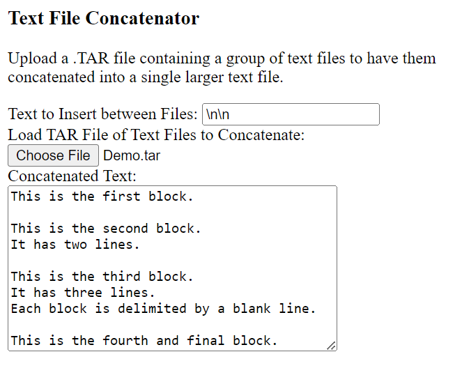

Text File Concatenator
======================

Concatenates a set of text files from an uploaded .TAR files
into a single text file.

Running
-------

This repository makes use of the thiscouldbebetter/TarFileExplorer repository
as a Git submodule, so in order to run TextFileConcatenator,
it will be necessary to clone the repository with the --recursive switch
on the command line, or, if it's already been cloned without the submodule,
by running "git submodule update --init ." from within the TarFileExplorer
directory.